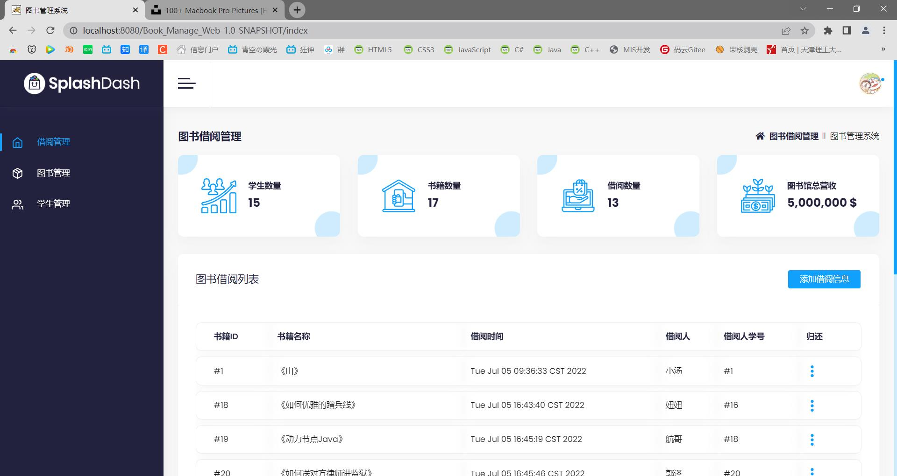
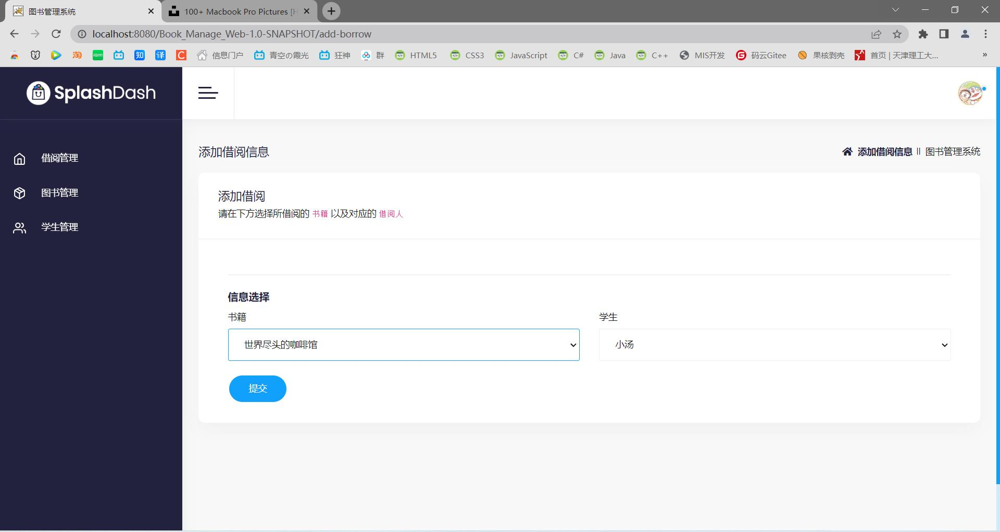

# BookManage_JavaWeb
基于java web(Servlet+Mybatis+Thymeleaf)的图书管理系统
## 项目成果展示

## 项目分析

### 项目需求

- [x] 图书管理员的登陆、权限校验、拦截

- [x] 用户退出

- [x] 图书的列表浏览（包括书籍是否被借出的状态也要进行显示）

- [x] 学生的列表浏览

- [x] 查看所有的借阅列表

- [x] 添加借阅信息

- [x] 图书的添加和删除

- [x] 学生的添加和删除

### 框架结构分析

本次实战使用到的框架：Servlet+Mybatis+Thymeleaf

在编写的时候，为了使得整体的代码简洁高效，我们严格遵守三层架构模式：

**表示层(前端页面+Servlet)**：Servlet向service层索要数据，接收前端页面的请求（发送页面解析）与响应（上下文）

**业务逻辑层(Service+ServiceImpl)**：才是用于进行数据处理的地方。逻辑层通过mapper索要数据，向servlet反应数据。

**数据访问层（Mybatis+mapper）**：数据访问层向下管数据库索要数据，向上为Service提供接口方法。

**实体类**：实体类贯穿三大层次，将数据封装在实体类中，以便于数据在三层架构中进行数据传递。

### 关于Thymeleaf

使用Thymeleaf可以有效地避免前后端耦合的情况，不过由于并没有Spring配置文件可以调整Thymeleaf的编码，项目的编码问题一直都在servlet和html中进行调配解决，在全局项目和当前项目都设置为utf-8之后，将html(thymeleaf编码设置为gbk)，并在servlet需要的方法中（doGet或者doPost中进行编码设置）可以使中文不会乱码。
